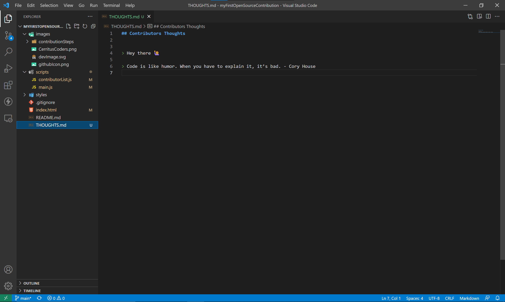

# My First Open Source Contribution

Find the project website here : https://cerrituscoderscomm.github.io/myFirstOpenSourceContribution/  
Make your own contribution and add your name here !!  

Thanks to [jwala](https://github.com/jwalapc/), for letting us use the code, go give him a follow :)
Hi there, let me walk you on how you can make your first Open-Source Contribution using this very project.

# How to contribute in this project ?

## Step 1: Fork this project

Fork the repository by clicking the fork button on the top of the page. This will create an instance of this repository in your account.

This instance will be an exact copy where you can chance and edit the project as per your choice!

---

## Step 2: Make changes
Once the repository is in your account, you can either make changes/edit to the project directly via GitHub GUI aur choose a text editor of your choice. Using a editor is recommended.

> **If you are using GitHub GUI to make changes skip to step 6 and then 8**

---

## Step 3: Download Git

Download the Git to get started.  
Git : https://git-scm.com/downloads  
---

## Step 4: Clone the repository

To edit it in an editor, clone it to your machine to work with it locally.

To clone, click on the `code` button and copy the link.
Now find the steps to open this in your editor of choice via Google and make the necessary edits!

---

## Step 5: Open Vscode and paste the clone link

Open your VScode and press `ctrl+shift+p` to open command pallet and choose `git clone` command, now paste the link that you copied from the github repo and choose a folder to store this repo. 

---

## Step 6: Edit the project

Look for bugs, improvements or UI tweaks, fix them and test if it's in working stage before creating pull request.

**Alternatively** you can add your thoughts about git and open-source community in the [Thoughts](./THOUGHTS.md) file.

---

## Step 7: Save and Push the changes

Save the changes by pressing `ctrl+s`. 

Then click on the git button in your vscode > click on add changes > write a commit message > click the click icon on top to commit the changes >click the 3 dots option button > then click push.

Now click push.

with this you made the changes and pushed it to your forked online repository of this project.

---

## Step 8: Make a pull request

Now that all the changes that you have made is available in your forked :

Click `contribute`

Click `Create pull request`

Add meaningful request message denoting your changes and then click `Create pull request`

With this you have successfully made your first contribution in an Open-Source projects!!!
